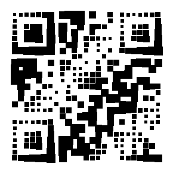
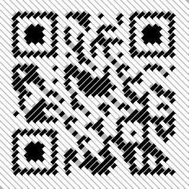
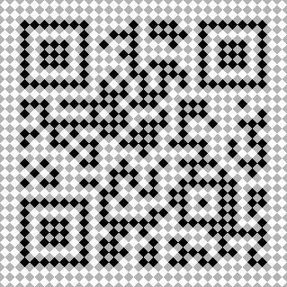
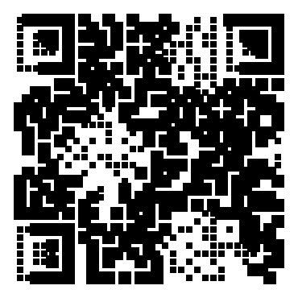

# qrust

feeling unemployed qr code generator

## Usage

```rs
let qr_code = generate("https://github.com/subygan/qrust", QrOptions::new()).unwrap();
```

This is what `QrOptions::new()` looks like.
```rs
QrOptions {
    min_version: Version(1),
    strict_version: false,
    min_ecl: ECL::Low,
    strict_ecl: false,
    mode: None, // None = automatically determined
    mask: None, // None = automatically determined
}
```

`generate()` has two possible errors.

`QrError::InvalidEncoding` occurs if `Mode::Numeric` or `Mode::Alphanumeric` is specified and the input string contains invalid  characters. `None` or `Mode::Byte` will not error.

`QrError::ExceedsMaxCapacity` is what it sounds like, but unless `strict_version` is set to true, this is very hard to trigger. The lower limit is exceeding 1273 characters with `Mode::Byte` and `ECL::High`. See [capacity table](https://www.thonky.com/qr-code-tutorial/character-capacities) for specifics.


### Low level usage

```rs
// This returns None if input string exceeds max capacity
let data = Data::new(
    "https://github.com/subygan/qrust",
    Mode::Byte,
    Version(1), // minimum Version
    ECL::Low, // minimum ECL
).unwrap();

// Pass None to determine and use "best" mask
let qr_code = QrCode::new(data, Some(Mask::M1));
```

The encoding `Mode` must be specified and no errors are thrown if it's invalid. This is fine because it's probably always `Mode::Byte`.

Alternatively, use `Data::new_verbose()` to force  `Version` and `ECL` to not upgrade. There is no real usecase for this.

```rs
let data = Data::new_verbose(
    "https://github.com/subygan/qrust",
    Mode::Byte,
    Version(1),
    true, // strict Version
    ECL::Low,
    true, // strict ECL
).unwrap();
```

## Examples

All example code is WIP and in a very unpolished state.

### `/examples/scale.rs`

Scaling modules based on position.

| Circle                                 | Stripes                                  | Waves                                |
| -------------------------------------- | ---------------------------------------- | ------------------------------------ |
|  |  |  |

### `/examples/weave.rs`

No need to stick to a boring pixel grid.

| Thick                                | Thin                               | Diagonal                               |
| ------------------------------------ | ---------------------------------- | -------------------------------------- |
|  |  |  |

### `/examples/layers.rs`

Layering is neat, but it can seriously degrade scanning ability if done without care.

See [Halftone QR Codes](https://cgv.cs.nthu.edu.tw/projects/Recreational_Graphics/Halftone_QRCodes), [Micrography QR Codes](https://cgv.cs.nthu.edu.tw/projects/Recreational_Graphics/MQRC), [Amazing QR](https://github.com/x-hw/amazing-qr) for more thoughtful implementations with high scannability.

| Background                                      | Minimalist                         | Improved scannability                  |
| ----------------------------------------------- | ---------------------------------- | -------------------------------------- |
|  |  |  |

### Misc bugs and experiments

| Have                                        | Some                                      | More                            |
| ------------------------------------------- | ----------------------------------------- | ------------------------------- |
|    |  |  |
|  |     |                                 |

## Other

- Great QR code generator tutorial
  - https://www.thonky.com/qr-code-tutorial/
- Reference generator implementations
  - https://github.com/erwanvivien/fast_qr
  - https://github.com/unjs/uqr
- Reference scanner implementations
  - https://github.com/zxing/zxing
  - https://github.com/opencv/opencv_contrib/tree/4.x/modules/wechat_qrcode (fork of zxing-cpp)

### TODO

- [x] send typed array to wasm

### Benchmarks

It's kinda slow, but this is probably not the bottleneck.

| Test     | Implementation | Time (µs) / (ms)     | Compared to `fast_qr` |
| -------- | -------------- | -------------------- | --------------------- |
| **V03H** | qrust           | 81.458 - 85.391 µs   | ~1.3 slower           |
|          | qrcode         | 299.16 - 309.98 µs   | ~4.8 slower           |
|          | fast_qr        | 63.305 - 64.625 µs   | 1.0 (Fastest)         |
| **V10H** | qrust           | 394.21 - 408.01 µs   | ~1.7 slower           |
|          | qrcode         | 1.3011 - 1.3232 ms   | ~5.5 slower           |
|          | fast_qr        | 238.47 - 243.73 µs   | 1.0 (Fastest)         |
| **V40H** | qrust           | 3.1761 - 3.2767 ms   | ~1.4 slower           |
|          | qrcode         | 11.228 - 11.683 ms   | ~5.0 slower           |
|          | fast_qr        | 2.2569 - 2.3325 ms   | 1.0 (Fastest)         |